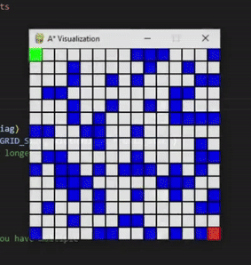

# AI-aStar-Search
This program creates a perfectly square search space based off the users input and performs numerous variations of A* with different heuristics displayed visually using pygame.

REQUIREMENTS: 
-Pygame is required for the visuals. Pygame can be installed with the command "pip install pygame".
-It is possible to alter the start state and goal state; however, when choosing the grid width and height the values must be the same i.e., width = 40, height=40.

CAPABILITIES:
-This program can perform A* with Manhattan or Euclidean heuristics. You can alter which heuristics function is called in the "astar" functionon on lines 262 and 272 by calling whicher heuristics function you prefer.

      -"heuristic_manhattan"  for Manhattan heuristics
      -"heuristic_euclidean"  forEuclidean heuristics
      
-Diagonal movement can also be enabled/disabled. To disable diagonal movement, make Diag=False. To enable diagonal movement, make Diag=True.
-Wall/obstacles can also be enabled/disabled, as well as percent increase or decrease. To enable obstacles/walls within the search space, on line 35, make WALL_PROBABILITY be greater than 0 and to your desired liklihood of the node becoming a wall. To disable obstacles/walls within the search space, on line 35, make WALL_PROBABILITY be less than or equal to 0. When creating the search space full of nodes, each nodes then have a percentage liklihood of themselves becoming a wall, below is that funciton: this is not a traditional maze.
          
          if random.randint(1, 100) < WALL_PROBABILITY:
            self.wall = True
            
ISSUES:
-If the visuals from pygame struggle to load, you can dissable the grid lines on lines 213, 217,219,224,229, and 245. This WILL result in the gridlines going away.

INSTRUCTIONS:
-Install pygame and all other dependencies
-Run
-Input width and height for state space (remember, must be the same height and width)
-Let the state space be created. (All nodes default path cost of 1)
-View popout window and watch A* in action

INTERPRET DATA:
-You can view the pygame popout to see in realtime how the algorithm works
      - You can slow down the progression of the algorithm by increasing the sleep on line 235
-In the terminal you can see the current node, neighbors/adjacent states it is aware of from the current state, and the shortest path.

BENCHMARKING:
- Time was calculated using the python time library
- Memory was calcualted using the python tracemalloc library

DATASET:
- Data set contains 2 replicates of each measurement averaged
- NO WALLS
  
          -Euclidean no diagonal-
              -100 states
              -10000 states
              -1000000 states
              -4000000 states
          -Manhattan no diagonal-
              -100 states
              -10000 states
              -1000000 states
              -4000000 states
        -Euclidean diagonal-
              -100 states
              -10000 states
              -1000000 states
              -4000000 states
        -Manhattan diagonal-
              -100 states
              -10000 states
              -1000000 states
              -4000000 states
-WALLS (10%)   

        -Euclidean diagonal-
              -100 states
              -10000 states
              -1000000 states
              -4000000 states
              -90250000 states
        -Manhattan diagonal-
              -100 states
              -10000 states
              -1000000 states
              -4000000 states
              -90250000 states
        -Euclidean no diagonal-
              -100 states
              -10000 states
              -1000000 states
              -4000000 states
              -90250000 states
        -Manhattan no diagonal-
              -100 states
              -10000 states
              -1000000 states
              -4000000 states
              -90250000 states
